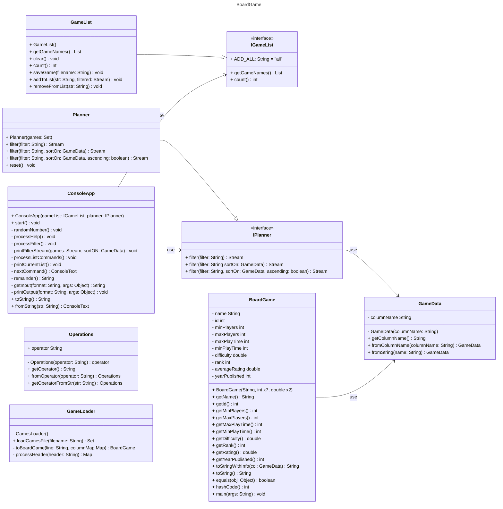
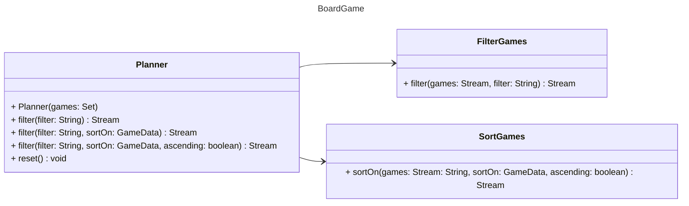

# Board Game Arena Planner Design Document

This document is meant to provide a tool for you to demonstrate the design process. You need to work on this before you code, and after have a finished product. That way you can compare the changes, and changes in design are normal as you work through a project. It is contrary to popular belief, but we are not perfect our first attempt. We need to iterate on our designs to make them better. This document is a tool to help you do that.

If you are using mermaid markup to generate your class diagrams, you may edit this document in the sections below to insert your markup to generate each diagram. Otherwise, you may simply include the images for each diagram requested below in your zipped submission (be sure to name each diagram image clearly in this case!)

## (INITIAL DESIGN): Class Diagram 

Include a UML class diagram of your initial design for this assignment. If you are using the mermaid markdown, you may include the code for it here. For a reminder on the mermaid syntax, you may go [here](https://mermaid.js.org/syntax/classDiagram.html)

### Provided Code

Provide a class diagram for the provided code as you read through it.  For the classes you are adding, you will create them as a separate diagram, so for now, you can just point towards the interfaces for the provided code diagram.

### Your Plans/Design

Create a class diagram for the classes you plan to create. This is your initial design, and it is okay if it changes. Your starting points are the interfaces. 

## (INITIAL DESIGN): Tests to Write - Brainstorm

Write a test (in english) that you can picture for the class diagram you have created. This is the brainstorming stage in the TDD process. 

> [!TIP]
> As a reminder, this is the TDD process we are following:
> 1. Figure out a number of tests by brainstorming (this step)
> 2. Write **one** test
> 3. Write **just enough** code to make that test pass
> 4. Refactor/update  as you go along
> 5. Repeat steps 2-4 until you have all the tests passing/fully built program

You should feel free to number your brainstorm. 

Test for `GameList`
1. Test `getGameNames()`from GameList 
   * empty list returns empty list
   * returns the list in ascending & alphabetical order
2. Test `clear()`from GameList
   * all games in the list are removed, returns an empty list
   * when list is empty, returns empty list
3. Test `count()`from GameList
   * counts number of names in list, returns the correct number
   * when list is empty, returns 0
4. Test `saveGame()`from GameList
   * games are saved to a file in order of getGameNames()
   * when a file already exists, file should overwrite
   * when the list is empty, empty file should be made
5. Test `addToList()` from GameList
    * single name is added to list
    * if '1' selected, adds first game from current filtered list
    * if range '1-5', adds games 1 - 5 to list
    * if range goes outside filtered list, add start of range to end of list
    * if all games selected, add all to list
    * if string invalid, throw IllegalArgumentException
6. Test `removeFromList()` from GameList
    * single name is specified, remove from list
    * if '1 name' selected, remove first game from current filtered list
    * if range '1-5', remove games 1 - 5 from current list
    * if all games selected, remove all from list
    * throw IllegalArgumentException if out of range or name doesnt exist
Test for `Planner`
1. Test `filter(String filter)`
   * returns games sorted by name ascending
   * when no game match, returns empty stream
   * empty string returns all games 
2. Test `filter(String filter, GameData sortOn)`
   * returns games sorted by a specified column ascending
3. Test `filter(String filter, GameData sortOn, boolean ascending)`
   * returns games sorted descending
   * when two filters applied, sorted accordingly
   * empty string returns current filtered sorted by specific column
4. Test `reset()`
   * clears the list returns full game list

## (FINAL DESIGN): Class Diagram

Go through your completed code, and update your class diagram to reflect the final design. It is normal that the two diagrams don't match! Rarely (though possible) is your initial design perfect. 

For the final design, you just need to do a single diagram that includes both the original classes and the classes you added. 

> [!WARNING]
> If you resubmit your assignment for manual grading, this is a section that often needs updating. You should double check with every resubmit to make sure it is up to date.

```mermaid
---
title: BoardGame
---
classDiagram
    direction TB
    BGArenaPlanner ..> GameLoader : uses
    BGArenaPlanner ..> ConsoleApp : uses
    
    ConsoleApp ..> IGameList
    ConsoleApp ..> IPlanner
    
    GameList ..|> IGameList
    Planner ..|> IPlanner
    
    Planner ..> FilterGames
    Planner ..> SortGame
    
    FilterGames ..> GameData
    FilterGames ..> Operations
    SortGames ..> GameData
    
    GameLoader ..> GameData
    Planner ..> BoardGame
    GameList ..> BoardGame
    FilterGames ..> BoardGame
    SortGame ..> BoardGame

   class BGArenaPlanner {
      - DEFAULT_COLLECTION: String = "/collection.csv"
      - BGArenaPlanner()
      + main(args: String) void
   }

   class GameLoader {
      - DELIMITER: String = ","
      + loadGamesFile(filename: String) Set<BoardGame>
      - toBoardGame(line: String, columnMap: Map<GameData, Integer>) BoardGame
      - processHeader(header: String) Map<GameData, Integer>
   }

   class ConsoleApp {
      + ConsoleApp(gameList: IGameList, planner: IPlanner)
      + start() void
      - randomNumber() void
      - processHelp() void
      - processFilter() void
      - printFilterStream(games: Stream<BoardGame>, sortON: GameData) void
      - processListCommands() void
      - printCurrentList() void
      - nextCommand() ConsoleText
      - remainder() String
      - getInput(format: String, args: Object) String
      - printOutput(format: String, args: Object) void
      + toString() String
      + fromString(str: String) ConsoleText
   }

   class IGameList {
      <<interface>>
      + ADD_ALL: String = "all"
      + getGameNames() List
      + count() int
   }

   class IPlanner {
      <<interface>>
      + filter(filter: String) Stream
      + filter(filter: String sortOn: GameData) Stream
      + filter(filter: String, sortOn: GameData, ascending: boolean) Stream
   }

   class GameList {
      + GameList()
      + getGameNames() List<String>
      + clear() void
      + count() int
      + saveGame(filename: String) void
      + addToList(str: String, filtered: Stream<BoardGame>) void
      + removeFromList(str: String) void
   }

   class Planner {
      + Planner(games: Set<BoardGame>)
      + filter(filter: String) Stream<BoardGame>
      + filter(filter: String, sortOn: GameData) Stream<BoardGame>
      + filter(filter: String, sortOn: GameData, ascending: boolean) Stream<BoardGame>
      + reset() void
   }

   class FilterGames {
      + filter(games: Stream<BoardGame>, filter: String) Stream<BoardGame>
   }

   class SortGame {
      + sortOn(games: Stream<BoardGame>: String, sortOn: GameData, ascending: boolean) Stream<BoardGame>
   }

   class GameData {
      - columnName String
      - GameData(columnName: String)
      + getColumnName() String
      + fromColumnName(columnName: String) GameData
      + fromString(name: String) GameData
   }

   class Operations {
      + operator String
      - Operations(operator: String) operator
      + getOperator() String
      + fromOperator(operator: String) Operations
      + getOperatorFromStr(str: String) Operations
   }

   class GameLoader {
      - GamesLoader()
      + loadGamesFile(filename: String) Set<BoardGame>
      - toBoardGame(line: String, columnMap Map<GameData, Integer>) BoardGame
      - processHeader(header: String) Map<GameData, Integer>
   }

   class BoardGame {
      +
   }
```

## (FINAL DESIGN): Reflection/Retrospective

> [!IMPORTANT]
> The value of reflective writing has been highly researched and documented within computer science, from learning to information to showing higher salaries in the workplace. For this next part, we encourage you to take time, and truly focus on your retrospective.

Take time to reflect on how your design has changed. Write in *prose* (i.e. do not bullet point your answers - it matters in how our brain processes the information). Make sure to include what were some major changes, and why you made them. What did you learn from this process? What would you do differently next time? What was the most challenging part of this process? For most students, it will be a paragraph or two. 

The major updates I made to this program were adding two helper classes, `FilterGames.java` and `SortGame.java`, for `Planner.java`. This is because Planner was responsible for filtering and sorting games, but didn't explain how to do so. I ran into an issue with creating the FilterGames class. I started with an else-if statement for every column in GameData, which not only was way too long, but also repeated a lot of code. To fix this issue, I created a helper method `compareNumbers()` that would be called in `filter()`. The helper method would check if min_player for game 'x' is greater_than (or whatever the operator is) the filter value the user wanted, and return true if the condition was met and that game would stay in the filtered list.

In `GameList.java` I had the games stored in a `HashSet` because the list should have no duplicates and I wanted a list with a fast lookup time. But because HashSet's don't have a particular order, the games only got sorted right before being returned to the caller.  
